<!--

  Copyright 2019 Province of British Columbia

  Licensed under the Apache License, Version 2.0 (the "License");
  you may not use this file except in compliance with the License.
  You may obtain a copy of the License at

  http://www.apache.org/licenses/LICENSE-2.0

  Unless required by applicable law or agreed to in writing, software distributed under the License is distributed on an "AS IS" BASIS,
  WITHOUT WARRANTIES OR CONDITIONS OF ANY KIND, either express or implied.
  See the License for the specific language governing permissions and limitations under the License.

-->

    library(tidyverse)

    library(raster)
    library(RStoolbox)
    library(rasterVis)

    library(mapview)
    library(mapedit)

    library(purrr)
    library(geosphere)

    library(RColorBrewer)

    library(smoothr)
    library(sf)
    library(measurements)
    library(ggspatial)

Import a Sentinel-2 satellite image using the `raster` package
--------------------------------------------------------------

    # Make a list of the "TIF" files in a directory of interest (only one multi-band raster in this case)
      files <- list.files(path = "../data/20191106_Day_2_PM_Raster/raster_sentinel", pattern = ".tif$", full.names = T)

    # Import stack 
      img <- stack(files)
      img

    ## class      : RasterStack 
    ## dimensions : 1235, 1462, 1805570, 10  (nrow, ncol, ncell, nlayers)
    ## resolution : 20, 20  (x, y)
    ## extent     : 507780, 537020, 5958360, 5983060  (xmin, xmax, ymin, ymax)
    ## crs        : +proj=utm +zone=10 +datum=WGS84 +units=m +no_defs +ellps=WGS84 +towgs84=0,0,0 
    ## names      : T10UEE_20//1911_20m.1, T10UEE_20//1911_20m.2, T10UEE_20//1911_20m.3, T10UEE_20//1911_20m.4, T10UEE_20//1911_20m.5, T10UEE_20//1911_20m.6, T10UEE_20//1911_20m.7, T10UEE_20//1911_20m.8, T10UEE_20//1911_20m.9, T10UEE_20//911_20m.10 
    ## min values :                629.75,                407.50,                242.75,                209.75,                120.00,                243.00,                215.00,                 57.00,                 28.00,                184.00 
    ## max values :              11204.25,              11857.75,              13733.50,              12755.75,              13306.00,              15238.00,              14526.00,              15286.00,              13940.00,              14591.00

    # Plot (Use max pixels to control speed)
      plot(img, maxpixels = 1e5)

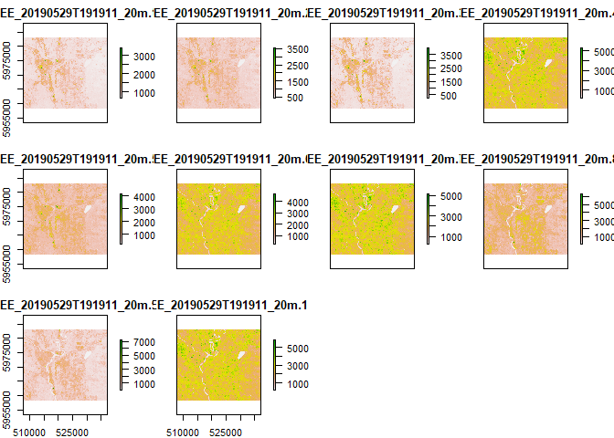

Change Band Names
-----------------

    # The correct names, in order, are (not always in this order..): 
      band_names <- c("blue","green","red","nir","rededge1","rededge2","rededge3","swir1","swir2","vegred")

    # Assign new names
      names(img) <- band_names

    # Note the new names 
      img

    ## class      : RasterStack 
    ## dimensions : 1235, 1462, 1805570, 10  (nrow, ncol, ncell, nlayers)
    ## resolution : 20, 20  (x, y)
    ## extent     : 507780, 537020, 5958360, 5983060  (xmin, xmax, ymin, ymax)
    ## crs        : +proj=utm +zone=10 +datum=WGS84 +units=m +no_defs +ellps=WGS84 +towgs84=0,0,0 
    ## names      :     blue,    green,      red,      nir, rededge1, rededge2, rededge3,    swir1,    swir2,   vegred 
    ## min values :   629.75,   407.50,   242.75,   209.75,   120.00,   243.00,   215.00,    57.00,    28.00,   184.00 
    ## max values : 11204.25, 11857.75, 13733.50, 12755.75, 13306.00, 15238.00, 14526.00, 15286.00, 13940.00, 14591.00

Plot multi-band RGB raster stack, three different ways
------------------------------------------------------

    # raster::plot
      plotRGB(x = img, r = "red", g = "green", b = "blue", maxpixels = 1e5, stretch = "lin")

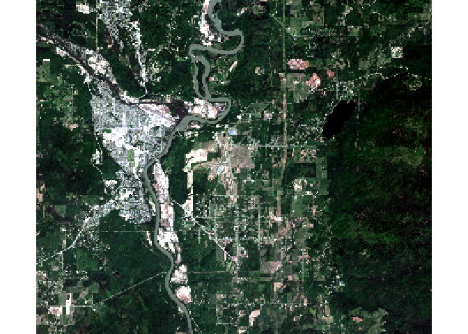

    # mapview::viewRGB
      viewRGB(x = img, r = "nir", g = "red", b = "green", maxpixels = 1e5)

    ## PhantomJS not found. You can install it with webshot::install_phantomjs(). If it is installed, please make sure the phantomjs executable can be found via the PATH variable.

    # RStoolbox::ggRGB
      ggRGB(img = img, r = "swir1", g = "nir", b = "red", maxpixels = 1e5, stretch = "lin") 

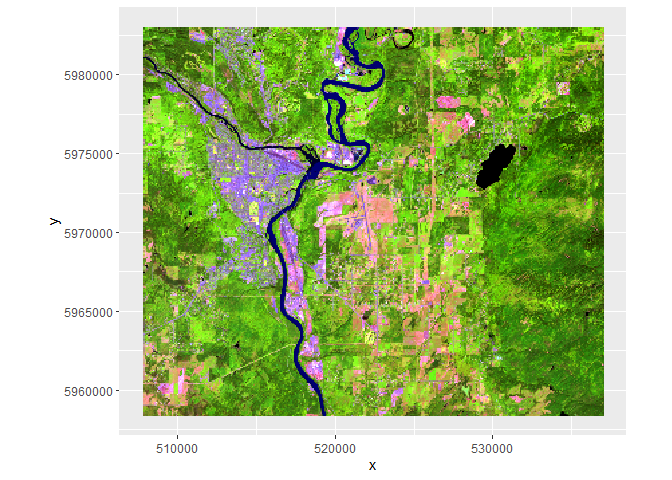

Calculat NDVI, two ways
-----------------------

    # Calculate NDVI using custom function 
    # e.g. NDVI = (NIR-RED)/(NIR+RED)

      normalized_difference <- function(img, b1, b2){
          out <- (img[[b1]]-img[[b2]])/(img[[b1]]+img[[b2]])
          return(out)}
      ndvi <- normalized_difference(img, "nir", "red")
      plot(ndvi)

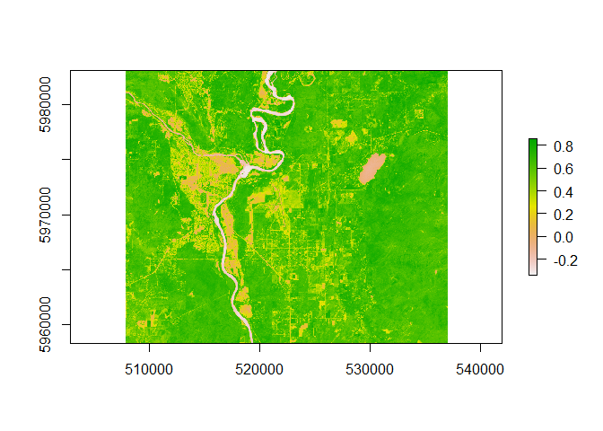

    # Calculate NDVI using bu in RStoolbox built in function
    # See https://bleutner.github.io/RStoolbox/rstbx-docu/spectralIndices.html 
    # for available indices

      ndvi <- spectralIndices(img, red = "red", nir = "nir", indices = "NDVI")
      ggR(ndvi)

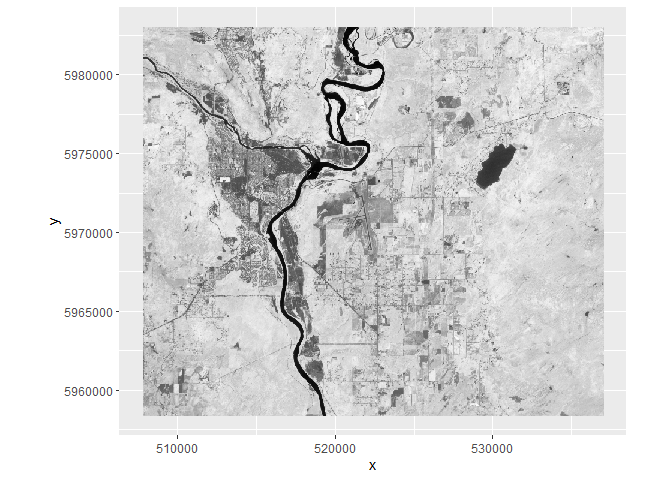

Custom palettes
---------------

    # Lets use RColorBrewer to use a nice color palette
      display.brewer.all()

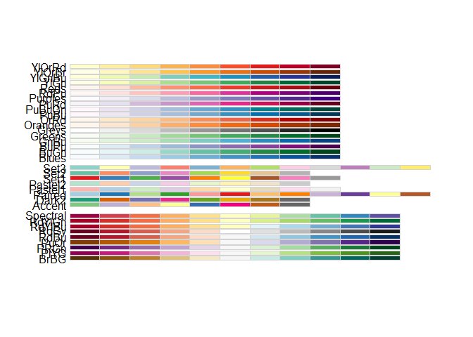

      display.brewer.pal(n = 10, name = "RdYlGn")

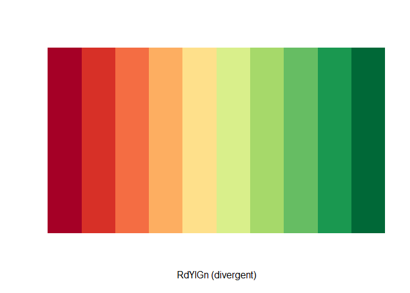

    # Define my palette 
      mypal <- brewer.pal(n = 10, name = "RdYlGn")

    # Plot NDVI with new colors
      plot(ndvi, col = mypal)

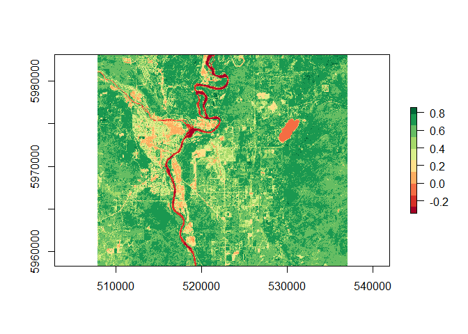

Remove NDVI &lt; 0.4
--------------------

    # If between -Ing and 0.4, then reclassify to NA. 
      veg <- reclassify(ndvi, cbind(-Inf, 0.4, NA))
      plot(veg, col = brewer.pal(4, "Greens"))

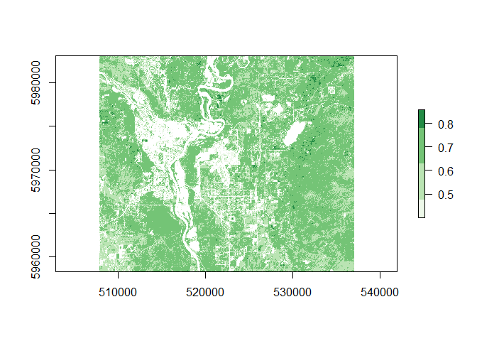
\#\# Plot NDVI and NDVI overlay

    plotRGB(img, r="nir", g="red", b="green", axes=TRUE, stretch="lin", main="Landsat False Color Composite with NDVI Overlay",)
    plot(veg, col = brewer.pal(9, "Greens"), add=TRUE, legend=FALSE)

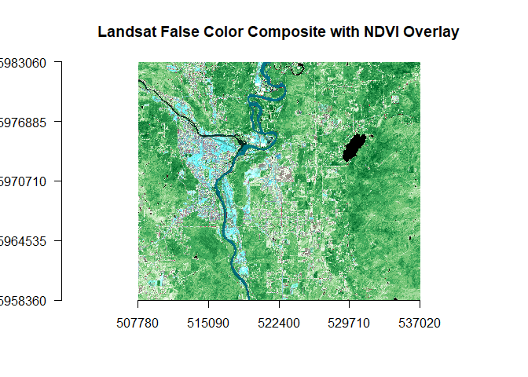

KMeans Classification
---------------------

    # Convert raster to numeric
      nr <- getValues(ndvi)

    # Set random number generator seed
      set.seed(23)

    # Run cluster analysis for 10 groups (can be slow)
      kmncluster <- kmeans(x = na.omit(nr), centers = 10)

    # Insert cluster values into the raster structure
      knr <- setValues(ndvi, kmncluster$cluster)

    # Plot
      mapview(knr)

Zonal Analysis
--------------

    # Get mean band values of each zone
      zonal_means <- zonal(x = img, 
                           z = knr, 
                           fun = mean, 
                           na.rm = T)

    # Plot the zonal means
      zonal_means %>% 
        as_tibble() %>% 
        gather("band","mean", -zone) %>% 
        mutate(band = factor(band, levels = band_names <- c("blue","green","red","nir","vre","rededge1","rededge2","rededge3","swir1","swir2"))) %>% # Reorder band names
        ggplot(aes(x = band, y = mean, group = zone)) +
          geom_line(aes(color = as.factor(zone))) +
          geom_point(aes(fill = as.factor(zone)), shape = 21, size = 3) + 
          theme_bw() +
          labs(x = "Band Name", 
               y = "Mean Spectral Value", 
               fill = "Zone", 
               color = "Zone", 
               title = "Mean spectral values by kmeans zone")

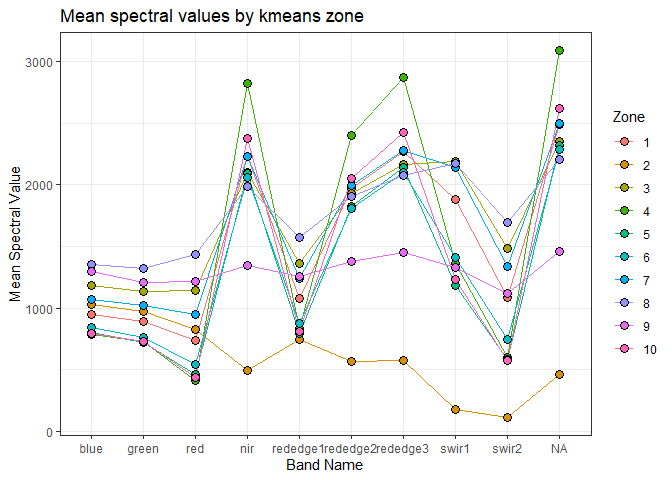

Extract water class as polygons
===============================

    # Make a copy of the classified raster 
      temp <- knr

    # Assume that the class with the lowest NIR values is water 
      water_class <- as_tibble(zonal_means) %>% 
        dplyr::filter(nir == min(nir)) %>% 
        dplyr::select(zone) %>% as.numeric()

    # Set classes that are not water to NA
      temp[temp != water_class] <- NA 

    # Mask the classified raster
      water <- mask(knr, temp)

    # Rclassify the water to '1'
      water[water > 0] <- 1

    # Plot
      plot(water)

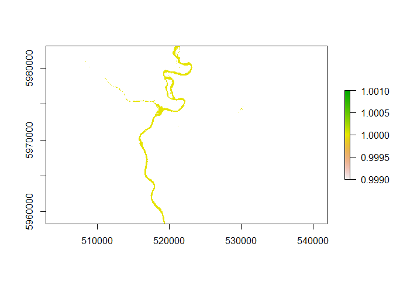

Polygonize the water raster, and clean it up
--------------------------------------------

    # Convert water class to polygons
      mypoly <- rasterToPolygons(x = water, dissolve = T)

    # Remove small chunks and fill holes
      mypoly_filter <- mypoly %>% 
        st_as_sf() %>% # from sp to sf
        st_cast("POLYGON") %>% # split multipolygon to polygons
        st_transform(3005) %>% # project into metres
        fill_holes(threshold = conv_unit(x = 0.1, from = "km2", to = "m2")) %>% # fill holes
        mutate(area_m2 = as.numeric(st_area(.))) %>% # calculate area
        filter(area_m2 >= conv_unit(x = 0.1, from = "km2", to = "m2")) # remove islands

    ## Warning in st_cast.sf(., "POLYGON"): repeating attributes for all sub-
    ## geometries for which they may not be constant

    # Plot water polygons over image
      ggRGB(img = img, r = "red", g = "green", b = "blue", maxpixels = 1e+06, stretch = "lin", alpha = 0.4) +
        geom_sf(data = st_transform(mypoly_filter, crs(img)), color = "darkblue", fill = "blue") +
        theme_bw() +
        scale_x_continuous(expand = c(0,0)) +
        scale_y_continuous(expand = c(0,0)) + 
        labs(x = "", y = "", title = "Water Mask")

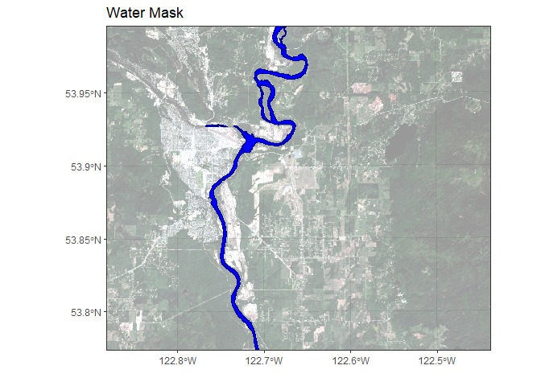

      ggsave("WaterMask.pdf")

Plot NDVI along a transect
--------------------------

    # Define line
      line <- cbind(c(-122.67618, -122.81251), c(53.88945, 53.88288)) %>%
        st_linestring() %>% 
        st_sfc(crs = 4326) %>% 
        st_sf()

    # Project the raster to the same crs as the line
      ndvi_t <- projectRaster(ndvi, crs = crs(line))

    # Plot
      ggR(ndvi_t) + 
        geom_sf(data = line, size = 2, color = "red")

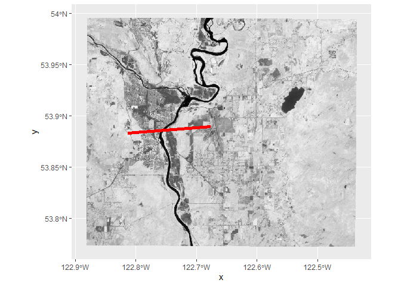

    # Extract values along the lines
      transect <- raster::extract(ndvi_t, line, along = T, cellnumbers=T)

    # Clean
      transect_df <- as_tibble(transect[[1]])
      
    # Calculate the Cell centroids
      transect_coords = xyFromCell(ndvi_t, transect_df$cell)

    # Calculate the distance between cell coordinates
      pair_dist = geosphere::distGeo(transect_coords)[-nrow(transect_coords)]
      
    # Calculate the cummulative distance
      transect_df$dist = c(0, cumsum(pair_dist))

    # Plot the NDVI transect
      ggplot(transect_df, aes(dist, NDVI)) +
        geom_line() 

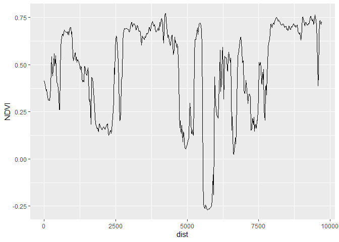
